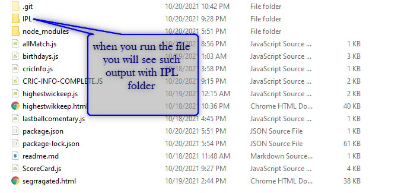
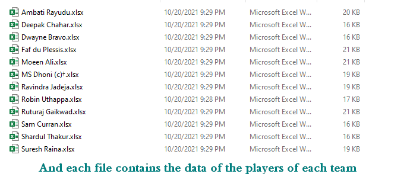

# CRIC-INFO-WEB-SCRAPPER
this is a web scrapping project which scraps data from the espnCricInfo.com website

npm modules to be installed from terminal.

<!-- xlsx , cheerio , postman-request -->

```
$ npm i xlsx
$ npm i cheerio
$ npm i postman-request
```

As an output you will see the following:



<br>



There are different files which results different output the above resulted output will be shown when you run CRIC-INFO-COMPLETE.JS
Try finding the outputs of the different different files 
you might see that some of them will return somthing in console.
and some will return nothing in console because are just for backend attachment for some other file.
hope you find the project interesting if you struck anywhere in the code feel free to connect on linkedIn.
peace to everyone 🙏.
